# ROS Wrapper for NebulaSDK

## Overview
This ROS package facilitates depth IR and RGB data acquisition and processing for NebulaSDK.

## Installation

- **Install the recommended [ROS distribution](http://wiki.ros.org/Distributions) for your operating system**
  - [ROS Install page](http://wiki.ros.org/ROS/Installation)

  **Version verified**
  |system|details|
  |---|---|
  |Ubuntu20.04|Noetic Ninjemys|
  |Ubuntu18.04|Melodic Morenia|
  |Ubuntu16.04|Kinetic Kame|
  |AArch64|Melodic|
- **Install the Vzense ROS package**

  - [Install NebulaSDK](https://github.com/Vzense/NebulaSDK)
    
    ```console
    git clone https://github.com/Vzense/NebulaSDK
    ```
    <p align="center"></p>
  - **Update SDK to ROS package**
    ```console
    cd ROS/src
    catkin_init_workspace
    ```
    After run <b>catkin_init_workspace</b>, it will generate the <b>CmakeLists.txt</b> in the <b>ROS/src</b> folder
    <p align="center">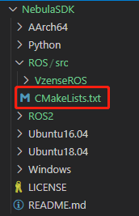</p>

    ```console
    cd VzenseROS_MultiCameras
    ```
    <p align="center"></p>

    <b>install.py</b>: copy <b>NebulaSDK</b> (match with your operating system) to <b>dependencies</b>, with the cmd "<b>python install.py (your operating system)</b>", take <b>Ubuntu18.04</b> as an example：
    ```console
    python install.py Ubuntu18.04
    ```
    <p align="center">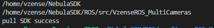</p>

 - **Build the VzenseROS package**
  ```console
  cd ../../
  catkin_make -DCATKIN_WHITELIST_PACKAGES="VzenseROS_MultiCameras"  
  ```
  <p align="center">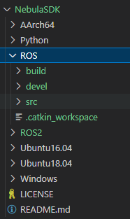</p>

 - **Environment setup**
  ```console
  source devel/setup.bash 
  ```
## Usage
- **Modify Launch**
  
  The <b>vzense_xxx.launch</b> support 2 cameras. Modiy the ip in <b>camera1.lauch</b> and <b>camera2.launch</b>
  <p align="center">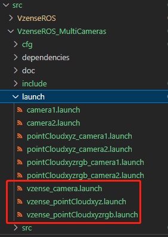</p>
  <p align="center">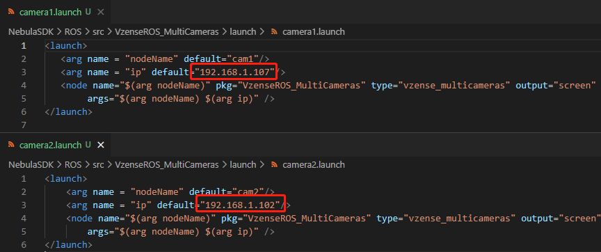</p>

- **Starting camera node**
    ```console
    roslaunch VzenseROS_MultiCameras vzense_camera.launch
    ```
    <p align="center">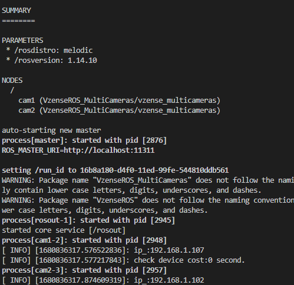</p>

    - <b>With Rviz show frame</b>

    Rviz can show frames of multi topics

    ```console
    rviz
    ```
    <p align="center">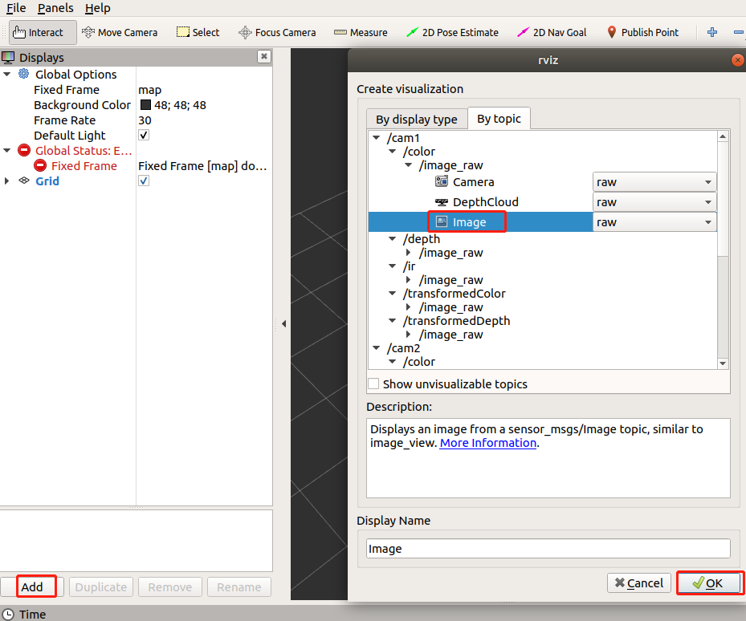</p>

    <p align="center">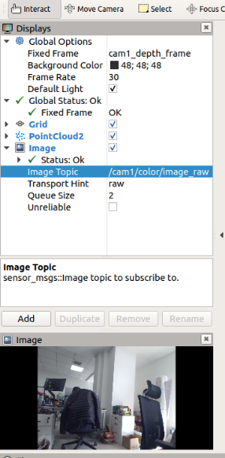</p>
    
    <p align="center">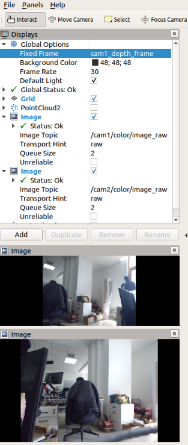</p>

    - <b>With RQT dynamic reconfigure</b>
    
    ```console
    rosrun rqt_reconfigure rqt_reconfigure
    ```
    <p align="center">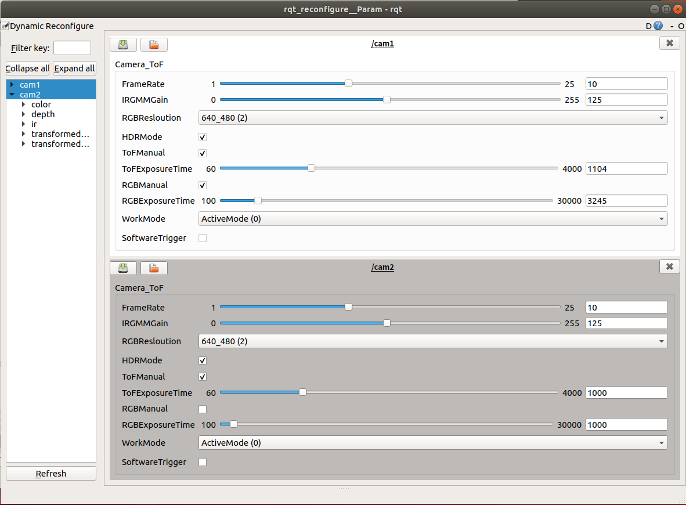</p>
    >**Instructions:**
    >
    >- Modifying the **FrameRate** will affect the maximum of **ToFExposureTime** and **RGBExposureTime**
    >- The value is invalid when **ToFExposureTime** or **RGBExposureTime**  is set above the maximum value
    >- **HDRMode** takes effect only when **ToFManual** is True
    >- **ToFManual** set to false is invalid when **HDRMode** is True

- **Show PointCloud**

    Rviz can only show one topic

    ```console
    roslaunch VzenseROS_MultiCameras vzense_pointCloudxyz.launch
    ```
    <p align="center">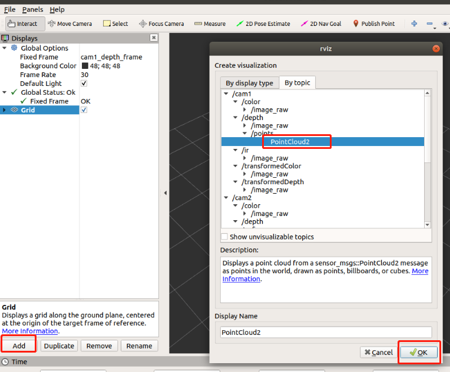</p>

    <p align="center">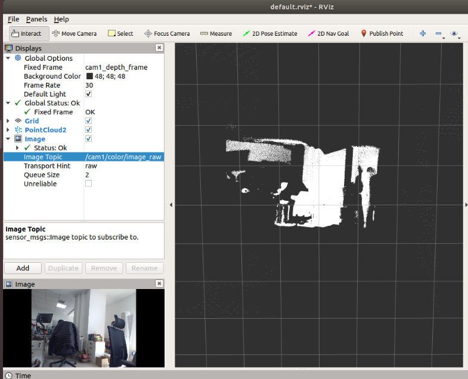</p>

    <p align="center">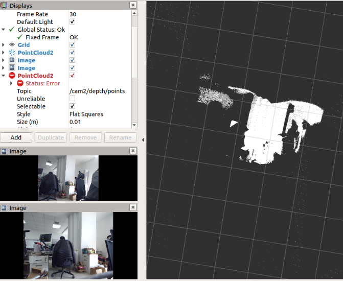</p>

- **Show PointCloud with RGB**

    Rviz can only show one topic

    ```console
    roslaunch VzenseROS_MultiCameras vzense_pointCloudxyzrgb.launch
    ```
    <p align="center">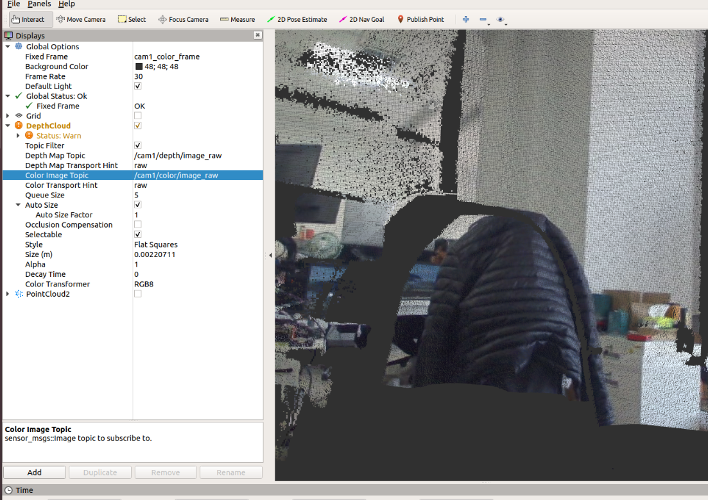</p>

## Published Topics
The vzense_manager publishes messages defined by the [sensor_msgs](http://wiki.ros.org/sensor_msgs) package on the following topics
- /<b>nodename</b>/depth/camera_info
- /<b>nodename</b>/color/image_raw
- /<b>nodename</b>/depth/image_raw
- /<b>nodename</b>/ir/image_raw
- /<b>nodename</b>/transformedDepth/image_raw
- /<b>nodename</b>/transformedColor/image_raw
  
    <p align="center">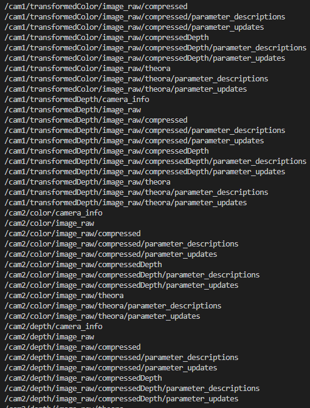</p>
## Programming guide
If developers need to set camera parameters or algorithm switches, please refer to the following process.
Take calling <b>VZ_SetSpatialFilterEnabled</b> as an example

- Find the api From **dependencies/Include/VzenseNebula_api.h**
<p align="center">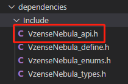</p>

- Add the code into **/src/vzense_manager.cpp**
<p align="center">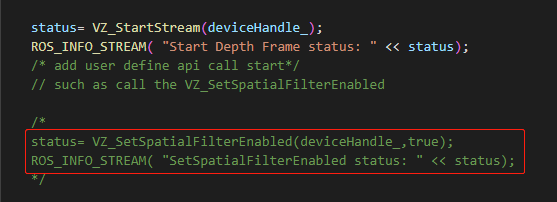</p>

## Details
- When using multiple network cards, set different IP network segments