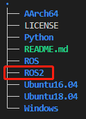
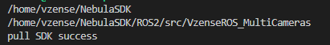
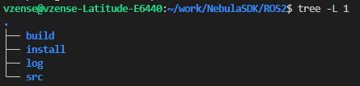
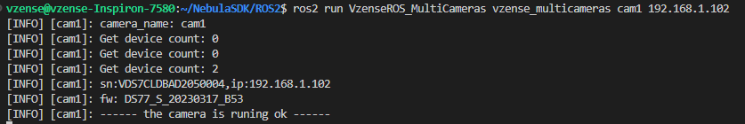
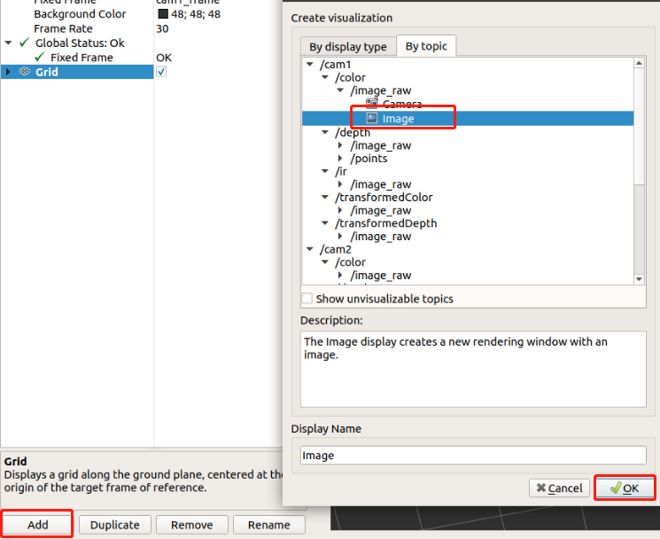
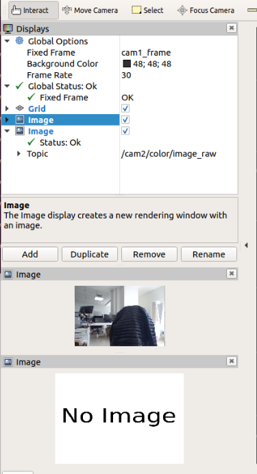
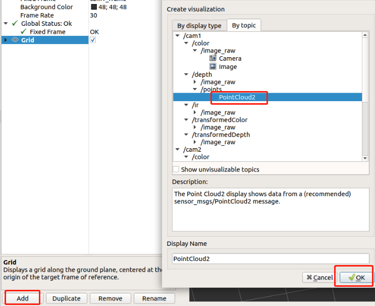
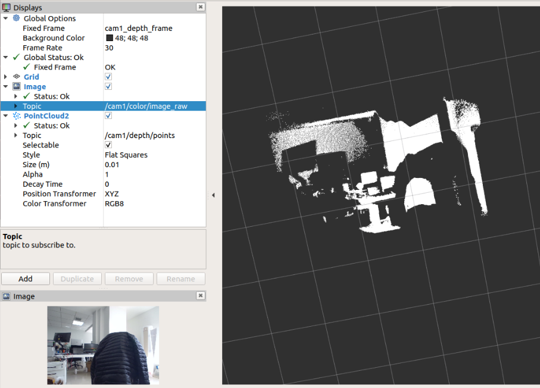
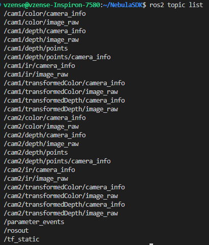
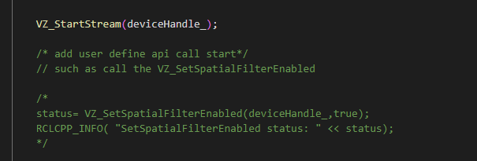

# ROS2 Wrapper for NebulaSDK

## Overview
This ROS2 package facilitates depth IR and RGB data acquisition and processing for NebulaSDK.

## Installation

- **Install the recommended [ROS distribution](http://wiki.ros.org/Distributions) for your operating system**
  - [ROS2 Install page](http://docs.ros.org/en/rolling/Installation.html)

  **Version verified**
  |system|details|
  |---|---|
  |Ubuntu20.04|Foxy Fitzroy|
  |Ubuntu18.04|Eloquent Elusor|

- **Install the Vzense ROS2 package**

  - [Install NebulaSDK](https://github.com/Vzense/NebulaSDK)
    
    ```console
    git clone https://github.com/Vzense/NebulaSDK
    ```
    <p align="center"></p>
  - **Update SDK to ROS2 package**
    
    ```console
    cd ROS2/src/VzenseROS_MultiCameras
    ```
  <p align="center"></p>
  
    <b>install.py</b>: copy <b>NebulaSDK</b> (match with your operating system) to <b>dependencies</b>, with the cmd "<b>python install.py (your operating system)</b>", take <b>Ubuntu18.04</b> as an example：
    ```console
    python install.py Ubuntu18.04
    ```
    <p align="center"></p>

 - **Build the VzenseROS2 package**

  If not installed colcon, run the cmd first:
  ```console
  sudo apt install python3-colcon-common-extensions
  ```
  ```console
  cd ../../
  colcon build --packages-select VzenseROS_MultiCameras
  ```
  <p align="center"></p>


 - **Environment setup**
  ```console
  source install/setup.bash 
  ```
## Usage
- **Starting camera node**
  
    ```console
    ros2 run VzenseROS_MultiCameras vzense_multicameras <nodename> <ip>
    ```
    such as:
    ```console
    ros2 run VzenseROS_MultiCameras vzense_multicameras cam1 192.168.1.102
    ```
    <p align="center"></p>
    
- **Rviz**
  
    Only one topic can be displayed at a time

    - <b>With Rviz show frame</b>
    
    ```console
    ros2 run rviz2 rviz2
    ```
    <p align="center"></p>
    
    <p align="center"></p>
    
    - <b>With Rviz show PointCloud</b>
    <p align="center"></p>
    
    <p align="center"></p>

## Published Topics
The vzense_manager publishes messages defined by the [sensor_msgs](http://wiki.ROS2.org/sensor_msgs) package on the following topics

- /<b>nodename</b>/color/camera_info
- /<b>nodename</b>/color/image_raw
- /<b>nodename</b>/depth/camera_info
- /<b>nodename</b>/depth/image_raw
- /<b>nodename</b>/depth/points
- /<b>nodename</b>/depth/points/camera_info
- /<b>nodename</b>/ir/camera_info
- /<b>nodename</b>/ir/image_raw
- /<b>nodename</b>/transformedColor/camera_info
- /<b>nodename</b>/transformedColor/image_raw
- /<b>nodename</b>/transformedDepth/camera_info
- /<b>nodename</b>/transformedDepth/image_raw
    <p align="center"></p>
## Programming guide
If developers need to set camera parameters or algorithm switches, please refer to the following process.
Take calling <b>VZ_SetSpatialFilterEnabled</b> as an example
- Find the api From **dependencies/Include/VzenseNebula_api.h**
<p align="center"></p>

- Add the code into **/src/vzense_manager.cpp**
<p align="center"></p>

## Details
- When using multiple network cards, set different IP network segments